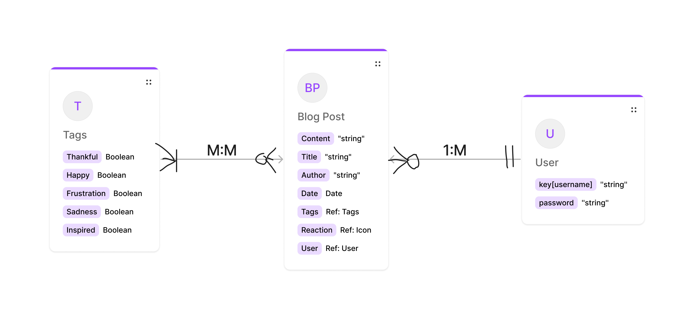
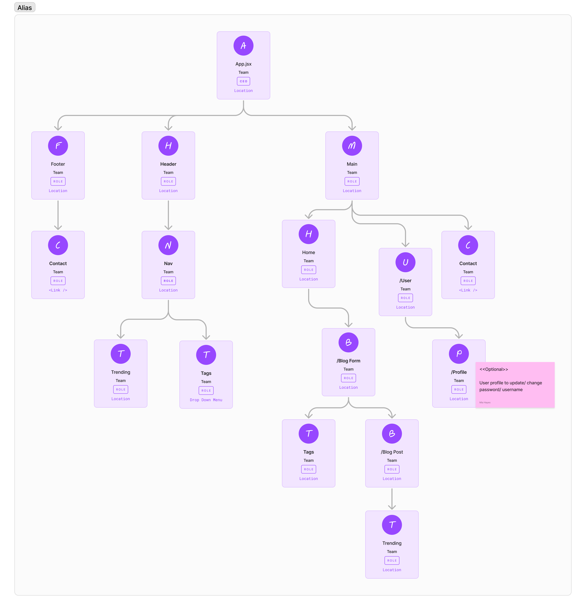
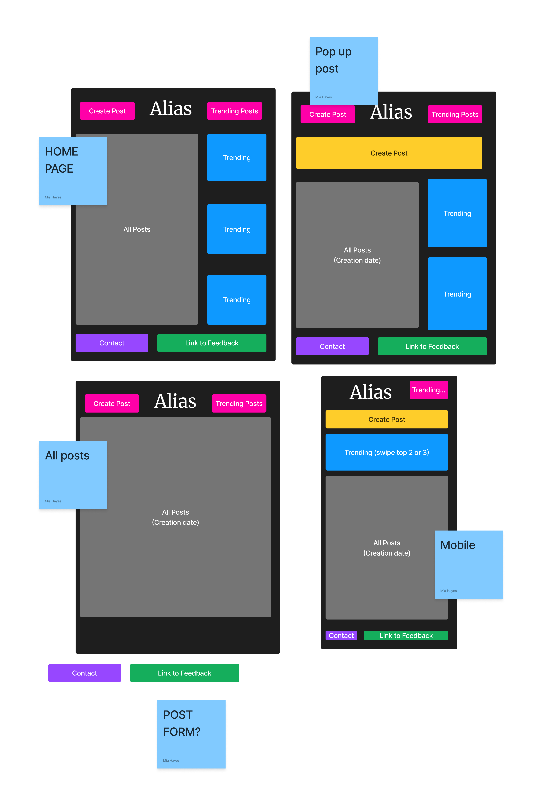

# Alias

## Summary:

**Alias** is a React MERN stack group project aimed to build a mobile first site where end users can post content under an alias. End users can also react to others' posts. Trending posts are also highlighted based on the level of engagement that post receives.

## Table of Contents

- [Team](#team)
- [Languages/Framework/Tools](#languagesframeworktools)
- [Entity Relationship Diagram](#entity-relationship-diagram)
- [Component Hierarchy Diagram](#component-hierarchy-diagram)
- [User Stories (MVP/Stretch Goals)](#user-stories-mvpstretch-goals)
- [Links](#links)
- [Other Credits](#other-credits)

### Team

[Felix Man](https://github.com/felixm126) |
[Mia Hayes](https://github.com/MiaDHayes) |
[Stephanie Cancel](https://github.com/persefy)

## Languages / Framework / Tools

#### Development Languages and Libraries:

- HTML
- CSS
- JavaScript
- React

#### Backend Technologies:

- Node.js
- Express
- MongoDB Atlas

#### Development Tools:

- Figma
- Trello

### Entity Relationship Diagram

### Component hierarchy diagram

### Wireframe

### User Stories

#### MVP

_**As a site visitor (not logged in):**_

- I want to see limited posts to help incentivize me to create an account
  - Display only trending posts in home page
  - Limit Posts displayed in ‘All Posts’ page (i.e., latest 3)
  - Limit Posts displayed in ‘Trending Posts’ page (i.e., top 3)
    _**As an end user (logged in):**_
- I want to have a **login page** where I can enter my credentials to log into my account, so I can view user account-specific information
  - Filtered view to see posts created by me
  - React to posts
- I want **access** to all the posts so that I can fully engage with the content on the site.
  - Full **Read** access to
    - 'All Posts Aside’ component nested in home
    - ‘Trending Posts Aside’ component nested in home
    - ‘Trending’ component page
    - ‘All Posts component page
- I want to be able to **Update** my own posts so that I can make any necessary changes.
  - Updating is limited to the creator of the post
- I want to be able to **Delete** my own posts so that I can remove any unwanted content I created.
  - Deleting is limited to the creator of the post
- I want to be able to **Create** a new post so that I can share my content on the site.
  - From Home page, there should be a quick view form to create a new post
  - Once post is created, a new item should be displayed in the list for ‘All Posts’
- I want my **reaction** to a post to be captured, so that I can share my impression from reading it.
  - Capture count for _‘Resonate’_ button on each post (TBD)
  - Capture count for _‘Inspired’_ button on each post (TBD)
  - Capture count for _‘Displeased’_ button on each post (TBD)
- I want to **see trending posts** so that I can read the most impactful posts.
  - Display set amount of [trending posts], determined by most reactions
    - Display nested component in home
    - Display in page dedicated to trending posts
    - Sort by count for all reaction buttons clicked (greatest to least)
- I want to **see all posts** so that I can ingest all the content that has been added.
  - Display set amount nested component in home
  - Display in page dedicated to all posts
  - Sort by created date/time (latest to oldest)
- I want to **see all of the posts under a tag** so that I can see related content
  - Upon user click of a tag on a post, display a page showing all posts containing the selected tag
- I want to **see my user account page** so that I can see my account specific information
  - See list of posts filtered by posts created by me
  - See **log out** button

#### Stretch Goals

- As a site visitor I want to be able to create a new user account so that I can enjoy all the features available in the site
  - Have a user account creation component and functionality to allow for user account creation

### Links

- [Add Trello link]

### Other Credits/Resources
